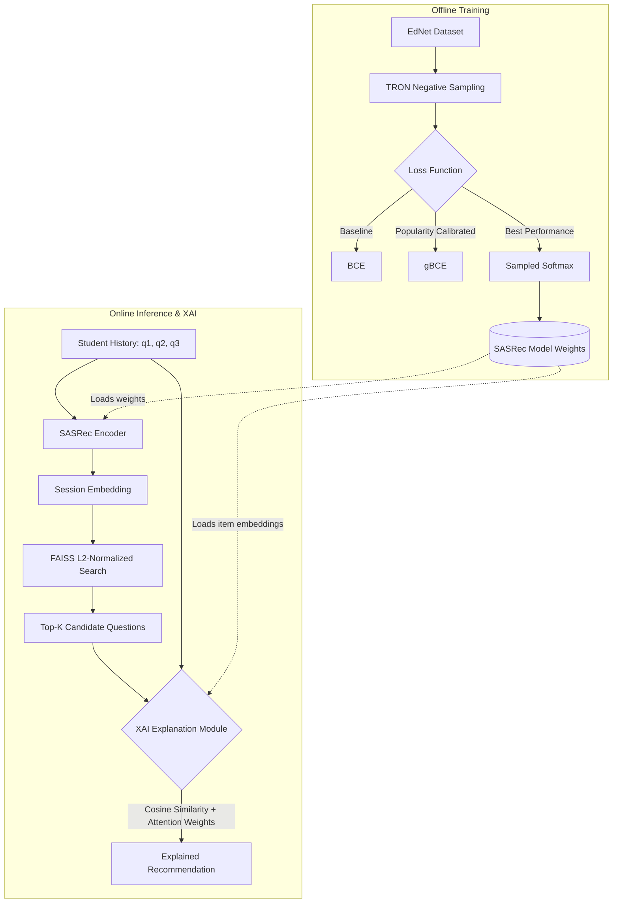

# 🎓 AI Teaching Assistant: Adaptive Learning Recommendation System
[](https://www.python.org/downloads/)
[](https://pytorch.org/)
[](https://github.com/facebookresearch/faiss)
[](https://streamlit.io/)
[](LICENSE)

Production-grade sequential recommendation system tailored for EdTech. It features state-of-the-art Transformer architectures, advanced negative sampling strategies, sub-10ms FAISS vector search, and Explainable AI (XAI) to dynamically adapt and guide student learning trajectories.

---

## ✨ Key Features

- 🧠 **State-of-the-Art Architecture**: Custom implementation of **SASRec** (Self-Attentive Sequential Recommendation) with modified Transformer layers designed to extract and expose raw Attention Weights for interpretability.
- ⚖️ **Advanced Loss & Sampling Strategies**: Rigorous comparison of BCE, **gBCE** (mitigates popularity bias), and **TRON** (Sampled Softmax with dynamic, mixed negative sampling: 50% random, 25% in-batch, 25% session-wise).
- 🔍 **Explainable AI (XAI)**: Every recommendation is accompanied by a human-readable explanation. The system calculates cosine similarity between the recommended item and the user's history, combined with layer-wise attention weights, to justify *why* a specific question was suggested.
- ⚡ **High-Performance Inference**: Utilizes **FAISS** (`IndexFlatL2`) with L2-normalized embeddings. Mathematically equivalent to cosine similarity search, delivering recommendations in **< 10ms**.
- 🗂️ **Unsupervised Topic Clustering**: Questions are automatically grouped into latent "topics" using KMeans. The optimal number of clusters ($k=5$) was rigorously determined using the **Elbow Method** and **Silhouette Score** (0.254).
- 🛡️ **Robust Regularization**: Systematic mitigation of overfitting on medium-sized datasets (50k users) via tuned Dropout (0.5), Weight Decay (1e-4), and optimized learning rates, ensuring stable generalization.

---

## 🏗️ System Architecture



---

## 🛠️ Tech Stack

| Category | Technologies |
| :--- | :--- |
| **Deep Learning** | PyTorch, Custom `MultiheadAttention` with `need_weights=True` |
| **Vector Database** | FAISS (Facebook AI Similarity Search, CPU-optimized) |
| **Machine Learning** | Scikit-learn (KMeans, Silhouette Score, Elbow Method) |
| **Frontend / UI** | Streamlit, Pandas, Matplotlib |
| **Data Processing** | Polars/Pandas, JSON, Parquet |
| **Infrastructure** | Python 3.12, Git LFS, WSL2, Jupyter Notebooks |

---

## 📊 Performance & Metrics

Evaluated on a filtered subset of the **EdNet (KT1)** dataset (50,000 users, ~12,000 unique questions, max sequence length 50). After applying systematic regularization to combat overfitting, the **TRON (Regularized)** model achieved the best ranking performance:

| Model Architecture | Loss / Sampling | HR@10 | NDCG@10 | Status |
| :--- | :--- | :---: | :---: | :--- |
| SASRec | BCE (Baseline) | 0.1561 | 0.0852 | Stable baseline |
| SASRec | gBCE + TRON Sampling | 0.1647 | 0.1002 | Best Hit Rate |
| **SASRec (Reg)** | **Sampled Softmax + TRON** | **0.1509** | **0.1184** | 🏆 **Best Ranking (NDCG)** |

*Inference Speed*: FAISS search for Top-5 recommendations averages **~4-8 ms** on consumer CPU.

---

## 🚀 Quick Start

### 1. Prerequisites
- Python 3.12 or higher
- Git & Git LFS (required for model weights and FAISS index)

### 2. Installation
Clone the repository and navigate to the project directory:
```bash
git clone https://github.com/KiZlador/Students_trajectory.git
cd Students_trajectory
```

Create and activate a virtual environment, then install dependencies:
```bash
python -m venv venv
source venv/bin/activate  # On Windows: venv\Scripts\activate
pip install -r requirements.txt
```
*(Note: Model weights `.pth` and FAISS `.index` files are tracked via Git LFS and will be downloaded automatically upon cloning).*

### 3. Run the Application
Start the interactive Streamlit dashboard:
```bash
streamlit run app.py
```
Open your browser and navigate to `http://localhost:8501`.

---

## 🧪 Research & Reproducibility

The `research/` directory contains the complete Jupyter Notebook pipeline used to develop this system:
1. `01-eda-and-data-preparation.ipynb`: Data filtering, sequence building, and vocabulary creation.
2. `02-model-and-training.ipynb`: Implementation of SASRec, custom training loops, TRON sampling, and regularization experiments.
3. `03-cluster-optimization.ipynb`: Unsupervised clustering of item embeddings, Elbow Method, and Silhouette Score analysis to determine optimal $k$.

---

## 📁 Project Structure

```text
Students_trajectory/
 ├── research/                       # Jupyter notebooks (EDA, Training, Clustering)
 ├── src/
 │   ├── __init__.py
 │   ├── model.py                    # SASRec architecture with XAI attention extraction
 │   └── recommender.py              # Inference logic, FAISS search, and explanation generation
 ├── saved_model/                    # Production artifacts (Git LFS tracked)
 │   ├── model_weights.pth           # Best performing model weights (TRON Reg)
 │   ├── faiss_index.index           # L2-normalized item embedding index
 │   ├── vocab.json                  # Item-to-Index and Index-to-Item mappings
 │   ├── cluster_info.json           # Optimized KMeans cluster assignments (k=5)
 │   ├── hyperparams.json            # Model hyperparameters and test metrics
 │   └── sample_inference.json       # Pre-defined sequences for UI testing
 ├── app.py                          # Streamlit interactive dashboard
 ├── requirements.txt                # Python dependencies
 ├── .gitattributes                  # Git LFS tracking configuration
 ├── .gitignore                      # Excludes venv, checkpoints, and raw data
 └── README.md                       # This file
```

---

## 💡 How the Explainable AI (XAI) Works

When a user requests an explanation for a recommended question, the system performs a dual-analysis:
1. **Cosine Similarity**: It computes the dot product between the L2-normalized embedding of the *recommended question* and the embeddings of all questions in the user's *current history*.
2. **Attention Weight Extraction**: It passes the history through the SASRec model and extracts the attention matrix from the final Transformer layer. It isolates the weights assigned to historical tokens when predicting the next state.
3. **Synthesis**: It ranks the historical questions by a combination of these two metrics and generates a natural language explanation (e.g., *"Recommended because it is 85% similar to question `q1234` from your history, which had the highest attention weight (42%) in your current session context"*).

---